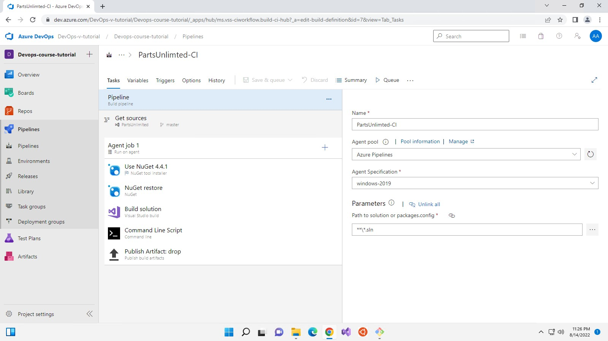
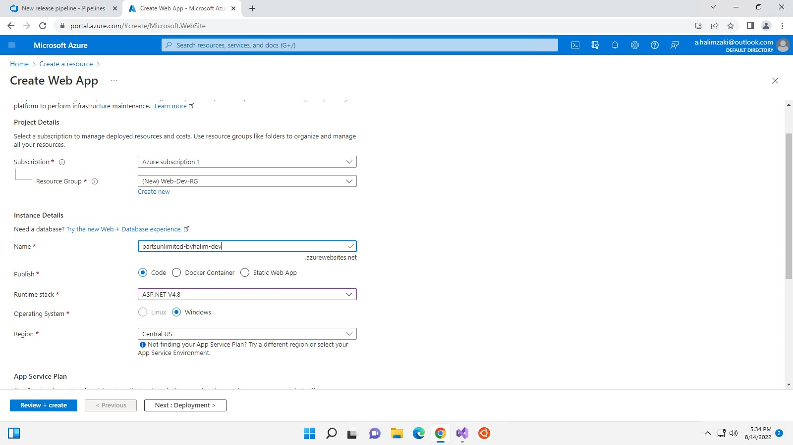
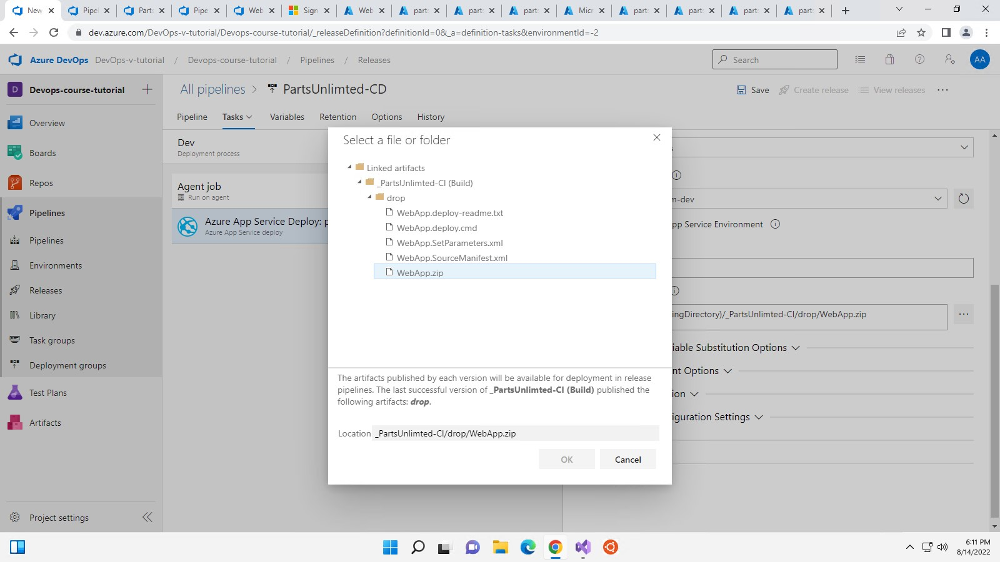
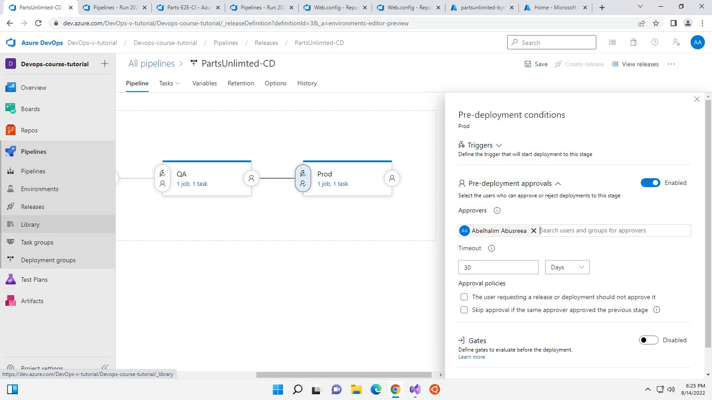
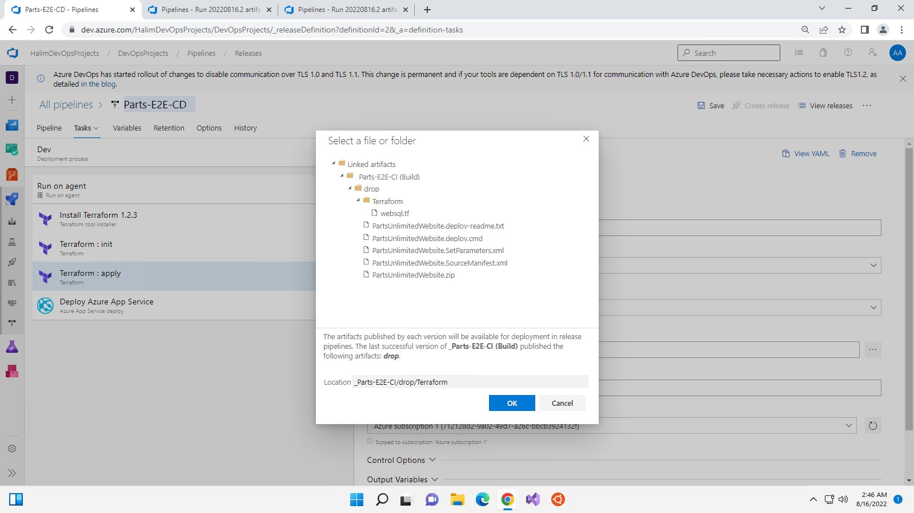
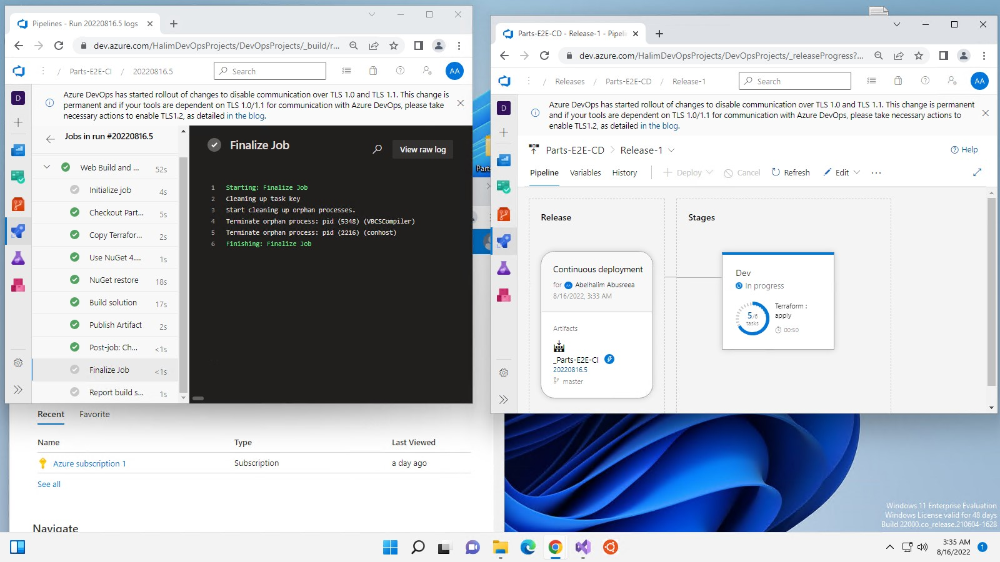
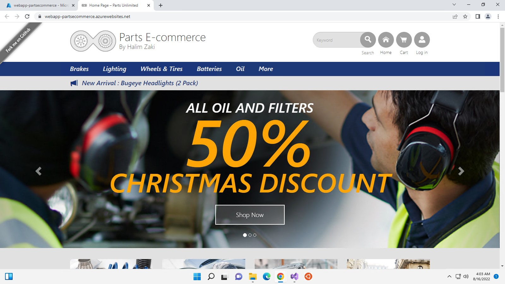

# Parts-Unlimted .Net WebApp E2E

* 1. [Project Description](#ProjectDescription)
* 2. [Services used in the project](#Servicesusedintheproject)
* 3. [E2E walk-through: CI](#E2Ewalk-through:CI)
	* 3.1. [Dev environment:](#Devenvironment:)
	* 3.2. [Creating the DB connection for each environment :](#CreatingtheDBconnectionforeachenvironment:)
	* 3.3. [Starting the Parts Unlimted CD and assigning where is the Artifact :](#StartingthePartsUnlimtedCDandassigningwhereistheArtifact:)
* 4. [E2E walk-through: CD](#E2Ewalk-through:CD)
	* 4.1. [A glimpse into the deployment stage work in progress.](#Aglimpseintothedeploymentstageworkinprogress.)
	* 4.2. [We Have scuessfuly deployed our website into the cloud provider](#WeHavescuessfulydeployedourwebsiteintothecloudprovider)
	* 4.3. [Preparing the other deployment stages and conditional approval for production environment.](#Preparingtheotherdeploymentstagesandconditionalapprovalforproductionenvironment.)
	* 4.4. [We can see that our dev-env and qa-env already live and the prod still waiting for my approval on the cd to prevent Mistakes , errors and bugs from reaching the main production environment.](#Wecanseethatourdev-envandqa-envalreadyliveandtheprodstillwaitingformyapprovalonthecdtopreventMistakeserrorsandbugsfromreachingthemainproductionenvironment.)
	* 4.5. [I navigated back into Azure DevOps platform and give the approval for deployment.](#InavigatedbackintoAzureDevOpsplatformandgivetheapprovalfordeployment.)
	* 4.6. [We Can see after clicking the approvel we can see that we our final stage already launched and live.](#WeCanseeafterclickingtheapprovelwecanseethatweourfinalstagealreadylaunchedandlive.)
* 5. [Deployment using terraform.](#Deploymentusingterraform.)
	* 5.1. [You can review the Iac from [Here](infra/websql.tf)](#YoucanreviewtheIacfromHereinfrawebsql.tf)
* 6. [Iac CI](#IacCI)
* 7. [Iac CD](#IacCD)
* 8. [To-Do](#To-Do)
	* 8.1. [Containerized the webapp for easier deployment.](#Containerizedthewebappforeasierdeployment.)

##  1. Project Description
The Project is a simple website that providing the ability to buy and sell parts as an e-commerce website i have decided to create the full cycle of DevOps CI/CD Life Cycle and i will go and describe what i'm doing in each phase so let's start.

##  2. Services used in the project

- Azure DevOps repos,CI/CD Pipelines/Artifact.
- Azure Cloud WebAppServices / Azure Sql.
- Iac deployment with terraform.

##  3. E2E walk-through: CI 

- I have used Azure Repos to upload the source code of the used example.
- I have configured a CI Pipeline to automaticaly build upon any new commit to the azure repo You can Check up the link for the CI [Here](https://dev.azure.com/DevOps-v-tutorial/Devops-course-tutorial/_build/results?buildId=26&view=logs&j=275f1d19-1bd8-5591-b06b-07d489ea915a&t=40b1ee41-44d6-5bba-aa04-4b76a5c732e5) the following image show up the used sequence on the CI Pipeline, After the CI is done with the build will store the package on Azure drop artifact.

CI Pipeline build agent sequence:

- After that it was the Azure server backend creation of Resource group that contain Web-app - Database and server for the connection.

- To create the full deployment plan I have created an environment for each stage Dev,QA and deployment the following pics show up creation of each stage.

- This is Dev environment  example and i don't want to post so many pictures so i will show only the dev env for now and you can check the others in the [Resources](assets/images/)
  
###  3.1. Dev environment: 
  

###  3.2. Creating the DB connection for each environment :

###  3.3. Starting the Parts Unlimted CD and assigning where is the Artifact :

##  4. E2E walk-through: CD 

-You can check the CD on Azure DevOps from [Here](https://dev.azure.com/DevOps-v-tutorial/Devops-course-tutorial/_release?_a=releases&view=mine&definitionId=3)

###  4.1. A glimpse into the deployment stage work in progress.

###  4.2. We Have scuessfuly deployed our website into the cloud provider

###  4.3. Preparing the other deployment stages and conditional approval for production environment.

###  4.4. We can see that our dev-env and qa-env already live and the prod still waiting for my approval on the cd to prevent Mistakes , errors and bugs from reaching the main production environment.

###  4.5. I navigated back into Azure DevOps platform and give the approval for deployment.

  
###  4.6. We Can see after clicking the approvel we can see that we our final stage already launched and live.

##  5. Deployment using terraform.

- we will notice the differnce between the manual steps of doplyment even though both is given in a CI/CD pipeline but the Iac is making it much easier since it will create the Infrastructure and it's compenet in the background given a single terraform file that will provide us with much easier for preparing multi envoriments and re-usability.

###  5.1.  You can review the Iac from [Here](infra/websql.tf)

- The terraform file will configure the resource groups, SQL DB, mantaine the connection string and configure the firewall rules that we did manually.

##  6. Iac CI

- The diffrence in the Ci for the Iac that we will mantine a copy of the tf along to be stored with the publish artifact so it can be used by the CD pipeline as shown in the picture below.

##  7. Iac CD 

- We can notice that we have new added tasks to our cd given that we using diffrent deployment method.
- installing, init then apply the terraform to our agent to be able to preform the terraform tasks since terraform needed to be installed on the machine that preforme the given task.
- locate our TF file to be able to deploy it.

- After the scuessful run of our CI our deployment to dev env started and as shown in the picture below that we still don't have anything created in our Azure portal.

- After few minutes we can notice that our resource group got created with it's components.

 

-Our website is live and ready to be used.

##  8. To-Do
###  8.1. Containerized the webapp for easier deployment.